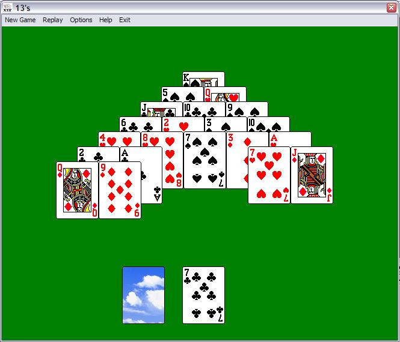



## Thirteen, a card game

### Description

A remake of this simple but entertaining card game only using Cards.dll and some API's. Has basic animation and sounds. Comes with help and code comments. I'm pleased with the final result and I think it's worth a look. (Zip 118KB) Paul Turcksin.
 
### More Info
 

             |
---                |---
**Submitted On**   |2007-11-20 15:29:44
**By**             |[Paul Turcksin](https://github.com/Planet-Source-Code/PSCIndex/blob/master/ByAuthor/paul-turcksin.md)
**Level**          |Beginner
**User Rating**    |5.0 (10 globes from 2 users)
**Compatibility**  |VB 6\.0
**Category**       |[Games](https://github.com/Planet-Source-Code/PSCIndex/blob/master/ByCategory/games__1-38.md)
**World**          |[Visual Basic](https://github.com/Planet-Source-Code/PSCIndex/blob/master/ByWorld/visual-basic.md)
**Archive File**   |[Thirteen\_\_20914211212007\.zip](https://github.com/Planet-Source-Code/paul-turcksin-thirteen-a-card-game__1-69654/archive/master.zip)

